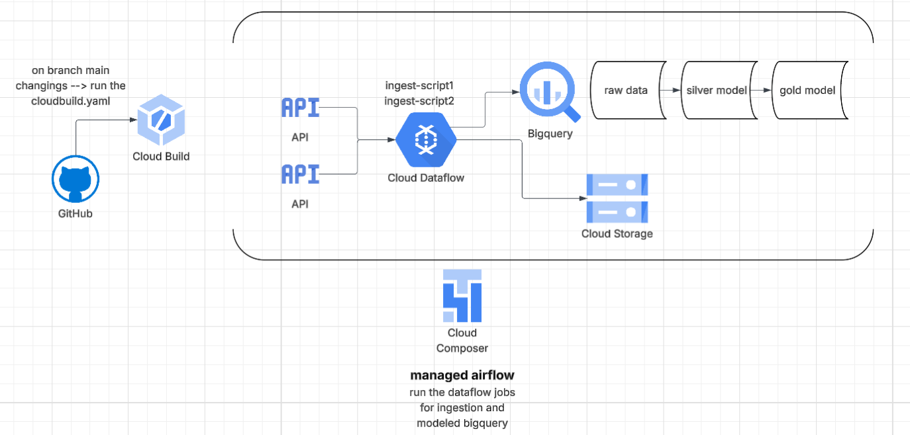

# DE_exam

Lightweight Data Engineering sample project — ingest football data from two external APIs, transform, persist as Parquet, and load to BigQuery. Includes Apache Beam pipelines, Airflow DAG, SQL models, and deployment artifacts for local testing or running on GCP Dataflow.

---

## Architecture Overview



This diagram shows the flow of data from the APIs through Dataflow Flex Templates, stored in GCS, and then transformed into Silver and Gold tables in BigQuery. Airflow orchestrates scheduling.

---

## Contents

- `.env` — environment variables (not committed)
- `Dockerfile`, `cloudbuild.yaml` — container and Cloud Build config
- `requirements.txt` — Python dependencies
- `dags/` — Airflow DAGs
  - `football.py` — DAG orchestrating pipelines and SQL models
- `src/`  
  - `Pipelines/` — Beam pipelines for data ingestion  
    - `ingest-api1.py` — pipeline for API 1  
    - `ingest-api2.py` — pipeline for API 2 (teams & standings)  
  - `bq_models/` — SQL models  
  - `templates_metadata/` — JSON metadata for Flex Templates
- `sql/` — transformation queries for silver/gold layers

---

## Project Goals

- Ingest teams and standings from external football APIs  
- Normalize and write data as Parquet (GCS/local)  
- Append data to BigQuery tables  
- Run pipelines locally (DirectRunner) or on GCP Dataflow (DataflowRunner)  
- Provide CI/CD and containerization examples via Cloud Build

---

## Prerequisites

- Python 3.8+ (match `requirements.txt`)  
- `pip`  
- (Linux/WSL recommended for pyarrow/Beam builds on Windows)  
- GCP project with billing enabled  
- Enabled APIs: Dataflow, Compute Engine, BigQuery, Cloud Storage  

---

## Setup & Instructions

### 1️⃣ Clone the Repository

```bash
git clone https://github.com/PROEESH/DE_exam.git
cd DE_exam
Verify the repo structure:

cloudbuild.yaml → Cloud Build pipeline

src/Pipelines/ → Dataflow Python scripts

templates_metadata/ → Flex Template metadata

dags/ → Airflow DAGs

sql/ → BigQuery SQL models

requirements.txt → Python dependencies

.env (optional for local API keys)

2️⃣ Set Environment Variables
Local Development
Create .env in repo root:

env 
Copy code
API_KEY_1=<your_api_key_1>
API_KEY_2=<your_api_key_2>
PROJECT_ID=<your_gcp_project_id>
Load via python-dotenv in scripts.

Cloud / Production
Use Google Secret Manager:

bash
Copy code
gcloud secrets create API_KEY_1 --data-file=<(echo "your_key_1")
gcloud secrets create API_KEY_2 --data-file=<(echo "your_key_2")
Grant Cloud Build service account access to read secrets.

powershell
# 1️⃣ Write your key to a temporary file
echo your_key_1 > api_key_1.txt
echo your_key_2 > api_key_2.txt

# 2️⃣ Create secrets from the files
gcloud secrets create API_KEY_1 --data-file=api_key_1.txt
gcloud secrets create API_KEY_2 --data-file=api_key_2.txt

#check them using the CLI
gcloud secrets list

3️⃣ Buckets Setup
bash
Copy code
# Templates / staging / temp
gsutil mb -l us-central1 gs://$PROJECT_ID-templates
gsutil mkdir gs://$PROJECT_ID-templates/staging
gsutil mkdir gs://$PROJECT_ID-templates/temp

# Raw Parquet output
gsutil mb -l us-central1 gs://sport__bucket
4️⃣ Composer (Airflow) Setup
Create Composer environment:

bash
Copy code
gcloud composer environments create my-composer \
    --location=us-central1 \
    --zone=us-central1-a \
    --machine-type=n1-standard-1 \
    --python-version=3 \
    --image-version=composer-2.2.5-airflow-2.7.1
Upload DAGs and SQL (automated via Cloud Build or manually):

bash
Copy code
# DAGs
gsutil cp dags/*.py gs://<COMPOSER_BUCKET>/dags/

# SQL
gsutil -m cp -r sql gs://<COMPOSER_BUCKET>/dags/
5️⃣ Cloud Build Pipeline
Trigger build from GitHub:

bash
Copy code
gcloud builds submit --config cloudbuild.yaml .
Cloud Build will:

Build Docker image for pipelines

Push image to gcr.io/$PROJECT_ID/beam-pipelines:latest

Build Flex Templates (ingest-api1.py & ingest-api2.py)

Upload DAGs & SQL to Composer bucket

Variables:

$PROJECT_ID → GCP project ID

_COMPOSER_BUCKET → Composer DAG bucket

6️⃣ Running Dataflow Jobs
Flex Templates in GCS:

bash
Copy code
gs://$PROJECT_ID-templates/ingest-api1.json
gs://$PROJECT_ID-templates/ingest-api2.json
Trigger manually:

bash
Copy code
gcloud dataflow flex-template run "ingest-api1-$(date +%Y%m%d-%H%M%S)" \
    --template-file-gcs-location gs://$PROJECT_ID-templates/ingest-api1.json \
    --region us-central1
Or schedule via Airflow DAG.

7️⃣ Airflow DAG Scheduling
DAG: football_ingest

Schedule: daily (@daily)

Tasks:

ingest_api1 → triggers first Dataflow job

ingest_api2 → triggers second Dataflow job

run_sql_models → executes BigQuery SQL (silver/gold)

8️⃣ BigQuery Setup
Tables:

teams.teams → raw data

Silver/Gold → processed via SQL models

Tables are auto-created if not existing using WRITE_APPEND and CREATE_IF_NEEDED.

9️⃣ Local Testing (Optional)
Install dependencies:

bash
Copy code
pip install -r requirements.txt
Run pipelines locally:

bash
Copy code
python src/Pipelines/ingest-api1.py
python src/Pipelines/ingest-api2.py
Uses .env for API keys.

🔒 Secrets & Security
Never commit .env to GitHub

Use Secret Manager for production

Inject secrets into Cloud Build and Composer as environment variables

🔑 Permissions
Cloud Composer service account needs these roles:

Dataflow Developer (roles/dataflow.developer) → create/run Dataflow jobs

Storage Object Admin (roles/storage.objectAdmin) → access GCS staging/templates

BigQuery Data Editor (roles/bigquery.dataEditor) → write tables

If you get:

lua
Copy code
HttpError 403: Could not create workflow; user does not have write access ...
permission: 'dataflow.jobs.create'
Grant Dataflow Developer role:

bash
Copy code
gcloud projects add-iam-policy-binding [PROJECT_ID] \
    --member="serviceAccount:[COMPOSER_SERVICE_ACCOUNT]" \
    --role="roles/dataflow.developer"
Replace [PROJECT_ID] and [COMPOSER_SERVICE_ACCOUNT].

✅ Summary Checklist
 Repo cloned with correct structure

 .env (local) or Secret Manager (cloud)

 Buckets created (templates, temp, staging, sport__bucket)

 Composer environment ready, DAGs & SQL uploaded

 Cloud Build triggered → Docker image + Flex Templates built

 Airflow DAG schedules ingestion + BigQuery models

 Local testing possible